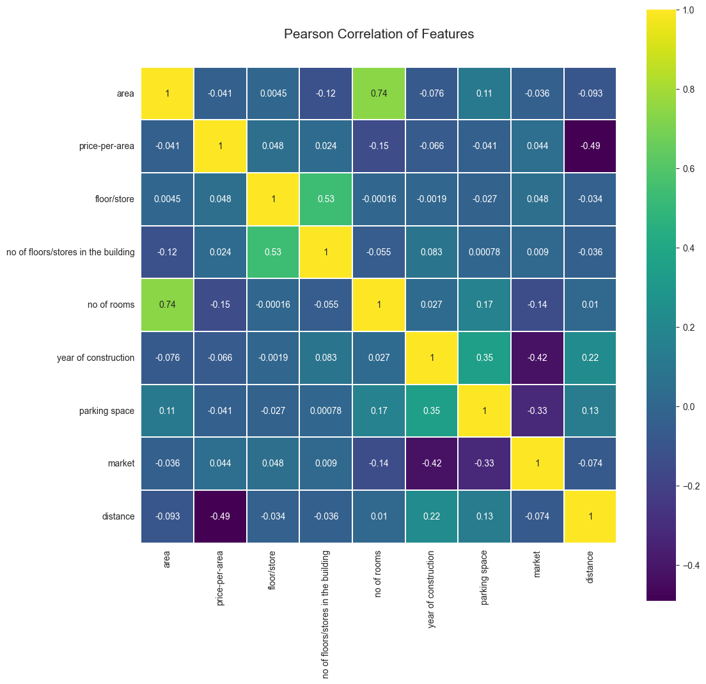
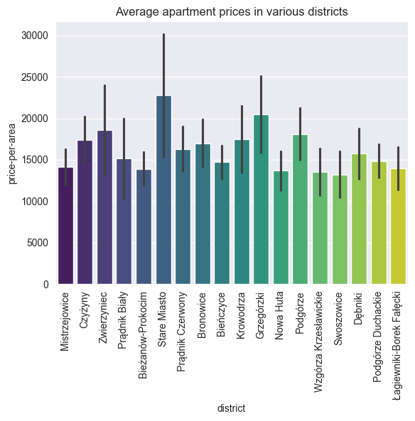
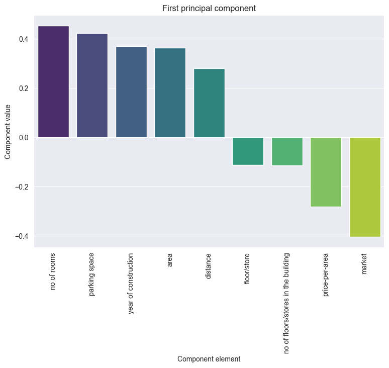
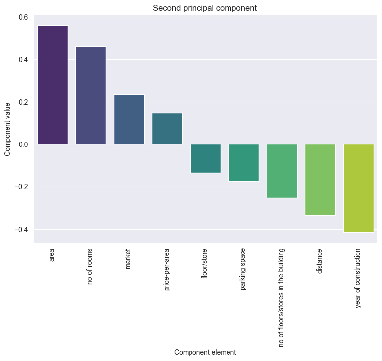
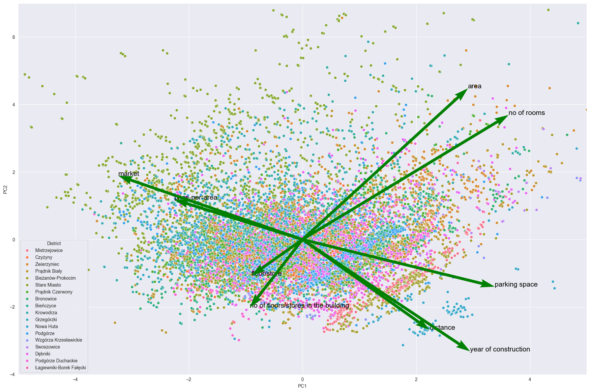

# Analiza cen nieruchomości w Krakowie

Projekt w ramach zajęć **Eksploracja Danych** realizowany w semestrze letnim r.a. 2023/2024 na Wydziale Informatyki Akademii Górniczo-Hutniczej w Krakowie pod opieką dra Tomasza Pełecha-Pilichowskiego.


### Autorzy
Katarzyna Dębowska

Kacper Sobczyk

Piotr Urbańczyk

    
   ### Abstrakt
Projekt ma na celu zrozumienie zależności między cechami mieszkań a ich cenami ofertowymi na lokalnym rynku nieruchomości. W ramach prac przeprowadzimy statystykę opisową, regresję hedoniczną oraz analizę przestrzenną w celu zidentyfikowania najważniejszych czynników wpływających na cenę mieszkań w Krakowie.
   
- **Dane**: Wykorzystano zbiór danych zawierający informacje o ofertach sprzedaży nieruchomości.
- **Źródło danych**: Dane zostały wyekstrahowane za pomocą metod automatycznych z dwóch popularnych portali zawierających oferty sprzedaży nieruchomości.
- **Przygotowanie danych**: Zrozumienie danych, usuwanie brakujących wartości, uspójnienie, konwersja formatów, uzupełnienie danych geograficznych (koordynatów) na postawie adresu, dodanie (wektora) odległości od centrum miasta (Rynku Głównego) na podstawie danych geograficznych itp. -- do ew. uzupełnienia w trakcie prac.
- **(Proponowane) analizy i modelowanie**: Statystyka opisowa, regresja hedoniczna, macierz korelacji (identyfikacja czynników wpływających na cenę nieruchomości), analiza przestrzenna (regresja ważona geograficznie [[1]](#1)) itp.  -- do ew. uzupełnienia po konsultacjach i w trakcie prac.
- **(Oczekiwane) wyniki**: Zrozumienie, które cechy nieruchomości najbardziej wpływają na cenę ofertową mieszkań w Krakowie, wykrycie ewentualnych trendów cenowych w poszczególnych dzielnicach itp. -- do ew. uzupełnienia w trakcie prac.

### Spis treści
1. [Zrozumienie danych](#zrozumienie-danych)

	1.1. [Gromadzenie danych](#gromadzenie-danych)

	1.2. [Opis danych](#opis-danych)

	1.3. [Wstępna ocena jakości danych](#wstępna-ocena-jakości-danych)
2. [Przygotowanie danych](#przygotowanie-danych)

	2.1. [Operacje na kolumnach](#operacje-na-kolumnach)

	2.2. [Przykłady zastosowania wiedzy eksperckiej](#przykłady-zastosowania-wiedzy-eksperckiej)

	2.3. [Weryfikacja jakości danych](#weryfikacja-jakości-danych)

	2.4. [Inżynieria danych](#inżynieria-danych)

	2.5. [Eksploracja danych](#inżynieria-danych)
3. [Analiza danych](#analiza-danych)

	3.1. [Macierz korelacji (macierz Pearsona)](#macierz-korelacji-macierz-pearsona)

	3.2. [Analiza cen mieszkań w różnych dzielnicach](#analiza-cen-mieszkań-w-różnych-dzielnicach)

    3.3. [Analiza komponentów bazowych (PCA)](#analiza-komponentów-bazowych-pca)
    
	3.4. [Wybór cech](#wybór-cech)
4. [Modelowanie](#czynności-wstępne)

	4.1. [SearchGrid](#gromadzenie-danych)

	4.2. [Wybór najlepszego predyktora](#opis-danych)

	4.3. [Ewaluacja wyników modelu](#weryfikacja-jakości-danych)
5. [Wizualizacja danych w komponencie przestrzennym](#wizualizacja-danych-w-komponencie-przestrzennym)
6. [Podsumowanie i wnioski](#czynności-wstępne)


   
## Zrozumienie danych
W projekcie wykorzystano zbiór danych zawierający informacje o ofertach sprzedaży mieszkań w Krakowie.
### Gromadzenie danych
#### Źródło danych
Dane zostały pozyskane za pomocą metod automatycznych ze źródeł w swobodnym dostępie -- dwóch popularnych portali
zawierających oferty sprzedaży nieruchomości: [nieruchomości-online.pl](nieruchomości-online.pl)
oraz [otodom.pl](otodom.pl).

#### Metody pozyskania danych
Oba zbiory danych zostały pozyskane przy użyciu profesjonalnego dedykowanego rozwiązania do scrapingu treści z sieci
Internet (pisanego w języku `Scala` a w przypadku crawli o charakterze dynamicznym wykorzystującego platformę `Selenium`).

Przykładowy fragment pliku konfiguracyjnego:
```json
"extractionTemplate": {
    ".box-offer-top h1.h1Title": {
        "resultId": "name/title",
        "optional": true
    },
    ".adress span": {
        "resultId": "address",
        "optional": true
    },
    ...
    "#detailsWrapper > div:first-of-type ul:nth-of-type(1) li:nth-of-type(5) span": {
        "resultId": "form of ownership",
        "optional": true
    }
}
```
Przykładowy fragment wyników crawli w formacie `json`:
```json
"url": "https://krakow.nieruchomosci-online.pl/mieszkanie,na-sprzedaz/24679599.html",
"results": [
	{
		"area": "41 m²",
		"market": "wtórny",
		"price": "750 000 zł",
		"name/title": "Mieszkanie, ul. Wawrzyńca",
		"no of floors/stores in the building": "4",
		"parking space": "-",
		"no of rooms": "2",
		"address": "Wawrzyńca, Kazimierz, Kraków, małopolskie",
		"price-per-area": "18 292,68 zł/m²",
		"floor/store": "2",
		"year of construction": "1930"
	}
],
```
Dane zostały następnie przekonwertowane do formatu `csv` (za pomocą prostego skryptu w języku `Python`).

### Opis danych

Dane zostały zebrane pięciokrotnie w okresie od 08.03.2024 do 05.05.2024 z interwałem dwutygotniowym
dla obu źródeł danych (nieruchomości-online.pl, otodom.pl) osobno. 

##### nieruchomosci-online dataset
Pliki otrzymane ze źródła nieuchomości-online.pl zawierają 13 kolumn: `'url', 'name/title', 'address', 'price', 'area', 'price-per-area',
       'floor/store', 'no of floors/stores in the building', 'no of rooms',
       'year of construction', 'parking space', 'market', 'form of ownership'`.

- Plik `2024-03-08-nieruchomosci-online_dataset_raw.csv` zawiera 3949 wierszy (bez nagłówka). 
- Plik `2024-03-25-nieruchomosci-online-full_raw_dataset.csv` zawiera 3348 wierszy (bez nagłówka). 
- Plik `2024-04-07-nieruchomosci-online_full_raw_dataset.csv` zawiera 4141 wierszy (bez nagłówka). 
- Plik `2024-04-21-nieruchomosci-online_full_raw_dataset.csv` zawiera 6185 wierszy (bez nagłówka). 
- Plik `2024-05-05-nieruchomosci-online_full_raw_dataset.csv` zawiera 6182 wierszy (bez nagłówka).

Dataframe, który został utworzony w wyniku scalenia powyższych plików
(zaktualizowania zmienionych i dodania nowych ofert), zawiera 9 659 wierszy.

```python
>>> 2024-03-08-nieruchomosci-online_dataset_raw.csv.size
3949
```
```python
>>> 2024-03-08-nieruchomosci-online_dataset_raw.csv.info
RangeIndex: 3949 entries, 0 to 3948
Data columns (total 13 columns):
 #   Column                               Non-Null Count  Dtype
---  ------                               --------------  -----
 0   url                                  3949 non-null   object
 1   name/title                           3949 non-null   object
 2   address                              3848 non-null   object
 3   price                                3920 non-null   object
 4   area                                 3949 non-null   object
 5   price-per-area                       3920 non-null   object
 6   floor/store                          3949 non-null   object
 7   no of floors/stores in the building  3710 non-null   float64
 8   no of rooms                          3949 non-null   object
 9   year of construction                 3949 non-null   object
 10  parking space                        3949 non-null   object
 11  market                               3918 non-null   object
 12  form of ownership                    1488 non-null   object
dtypes: float64(1), object(12)
memory usage: 401.2+ KB
```

```python
>>> 2024-03-08-nieruchomosci-online_dataset_raw.csv.head(10)
                                                 url                      name/title  ...                                             market           form of ownership
0  https://krakow.nieruchomosci-online.pl/mieszka...  Mieszkanie, ul. Żelechowskiego  ...                                             wtórny                    własność
1  https://krakow.nieruchomosci-online.pl/mieszka...         Mieszkanie, ul. Balicka  ...                                             wtórny  własność, księga wieczysta
2  https://krakow.nieruchomosci-online.pl/mieszka...          Mieszkanie, ul. Zauchy  ...                                             wtórny                         NaN
3  https://krakow.nieruchomosci-online.pl/mieszka...      Mieszkanie, ul. Racławicka  ...                                             wtórny                         NaN
4  https://krakow.nieruchomosci-online.pl/mieszka...        Mieszkanie, ul. Pustynna  ...                                             wtórny  własność, księga wieczysta
5  https://krakow.nieruchomosci-online.pl/mieszka...               Apartament Kraków  ...  pierwotny (zobacz inne nowe mieszkania w Krako...                    własność
6  https://krakow.nieruchomosci-online.pl/mieszka...      Mieszkanie, ul. Przemiarki  ...                                             wtórny                    własność
7  https://krakow.nieruchomosci-online.pl/mieszka...     Mieszkanie, ul. Felińskiego  ...                                             wtórny                         NaN
8  https://krakow.nieruchomosci-online.pl/mieszka...       Apartament, ul. Lublańska  ...                                             wtórny  własność, księga wieczysta
9  https://krakow.nieruchomosci-online.pl/mieszka...   Apartament, ul. Szablowskiego  ...                                             wtórny  własność, księga wieczysta
```

##### otodom_dataset

Pliki otrzymane ze źródła otodom.pl zawierają 20 kolumn: `'url', 'name/title', 'address', 'price', 'area', 'price-per-area',
       'floor/store', 'no of rooms', 'year of construction', 'parking space',
       'market', 'form of ownership', 'condition', 'rent', 'heating',
       'advertiser type', 'elevator', 'outdoor area', 'building type',
       'building material'`

- Plik `2024-03-08-otodom_dataset_raw.csv` zawiera 6819 wierszy (bez nagłówka).
- Plik `2024-03-25-otodom-full_raw_dataset.csv` zawiera 7130 wierszy (bez nagłówka).
- Plik `2024-04-07-otodom_full_raw_dataset.csv` zawiera 7148 wierszy (bez nagłówka).
- Plik `2024-04-21-otodom_full_raw_dataset.csv` zawiera 7436 wierszy (bez nagłówka).
- Plik `2024-05-05-otodom-full_raw_dataset.csv` zawiera 7465 wierszy (bez nagłówka).

Dataframe, który został utworzony w wyniku scalenia powyższych plików
(zaktualizowania zmienionych i dodania nowych ofert), zawiera 14 171 wierszy.

```python
>>> 2024-03-08-otodom_dataset_raw.csv.size
136400
```

```python
>>> 2024-03-08-otodom_dataset_raw.csv.info
RangeIndex: 6820 entries, 0 to 6819
Data columns (total 20 columns):
 #   Column                Non-Null Count  Dtype
---  ------                --------------  -----
 0   url                   6820 non-null   object
 1   name/title            6820 non-null   object
 2   address               6820 non-null   object
 3   price                 6820 non-null   object
 4   area                  6820 non-null   object
 5   price-per-area        6526 non-null   object
 6   floor/store           6720 non-null   object
 7   no of rooms           6820 non-null   object
 8   year of construction  6154 non-null   object
 9   parking space         4206 non-null   object
 10  market                6154 non-null   object
 11  form of ownership     4941 non-null   object
 12  condition             5229 non-null   object
 13  rent                  2846 non-null   object
 14  heating               4913 non-null   object
 15  advertiser type       6154 non-null   object
 16  elevator              6154 non-null   object
 17  outdoor area          5088 non-null   object
 18  building type         6154 non-null   object
 19  building material     6154 non-null   object
dtypes: object(20)
memory usage: 1.0+ MB
```

```python
>>> 2024-03-08-otodom_dataset_raw.csv.head(10)
                                                 url                                         name/title  ...    building type building material
0  https://www.otodom.pl/pl/oferta/gotowe-2-pokoj...          Gotowe| 2 pokoje| blisko centrum| Bonarka  ...  apartamentowiec   brak informacji
1  https://www.otodom.pl/pl/oferta/4-pok-mieszkan...  4-pok.mieszkanie z Sauną - Wysoki Standard ! 2...  ...  brak informacji             cegła
2  https://www.otodom.pl/pl/oferta/3-pokoje-w-rza...            3 pokoje w rządowym programie kredyt 2%  ...             blok   brak informacji
3  https://www.otodom.pl/pl/oferta/mieszkanie-ide...           Mieszkanie idealne na start, 3 - pokoje!  ...  apartamentowiec   brak informacji
4  https://www.otodom.pl/pl/oferta/ul-lasowka-3-p...          ul. Lasówka, 3 pokoje, 65m2 + taras 20m2!  ...  brak informacji   brak informacji
5  https://www.otodom.pl/pl/oferta/przestronne-mi...  Przestronne mieszkanie / 5 pok -113m2 / Kurdwanów  ...             blok   brak informacji
6  https://www.otodom.pl/pl/oferta/przestronne-m2...  Przestronne M2 z ogródkiem,Blisko Ronda Matecz...  ...  apartamentowiec   brak informacji
7  https://www.otodom.pl/pl/oferta/bk2-3-pokoje-d...          Bk2%, 3 pokoje, duży salon, jasne, balkon  ...             blok              inny
8  https://www.otodom.pl/pl/oferta/mieszkanie-w-m...                       Mieszkanie w Mistrzejowicach  ...             blok   brak informacji
9  https://www.otodom.pl/pl/oferta/3-pokoje-z-ust...    3 pokoje z ustawnym salonem | Dobra komunikacja  ...             blok   brak informacji
```

### Wstępna ocena jakości danych

- Ponieważ serwis orodom.pl umożliwiał zebranie większej liczby informacji o oferowanych nieruchomościach, dane pochodzące z tego serwisu zawierają więcej cech (kolumn).
- Informacja o piętrze, na którym znajduje się nieruchomość, w zbiorze `nieruchomosci-online_dataset_raw.csv` zawarta jest w dwóch kolumnach *floor/store* oraz *no of floors/stores in the building*. Ta sama informacja w zbiorze `otodom_dataset_raw.csv` zawarta jest w jednej kolumnie -- *floor/store* i przybiera postać postać [piętro]/[liczba pięter], np. "1/5". W przypadku potrzeby wspólnej analizy obu zbiorów, dane powinny zostać ujednolicone.
- Z uwagi na pochodzenie danych, większość kulumn w obu zbiorach zawiera dane tekstowe, wymagające konwersji w celu dalszych analiz.
- Z uwagi na sposób pozyskania danych, zbiór `nieruchomosci-online_dataset_raw.csv` zawiera pewną liczbę niepoprawnych wierszy wynikających z nietypowego ustawienia selektorów na stronie zawierającej ogłoszenie o sprzedaży. Dotyczy to zwłaszcza nieruchomości z rynku pierwotnego. Dane w tych wierszach będą musiały zostać odtworzone lub usunięte.
- W niewielkiej liczbie przypadków dane o nieruchomościach z rynku pierwotnego nie zawierają ceny (wybrano opcję "Zapytaj o ofertę").
- W niewielkiej liczbie przypadków cena w ofercie podana jest w innej walucie (euro).
- Z uwagi na charakter rynku (działania pośredników i agencji) oraz stron zawierających oferty sprzedaży nieruchomości, oba zbiory zawierają potencjalnie wiele wierszy dotyczących tego samego mieszkania (potencjalne "duplikaty" ofert pochodzące od różnych pośredników).
- Z uwagi na charakter rynku (ukrywanie dokładnego adresu nieruchomości przez pośredników i agencje), informacje o położeniu nieruchomości są najczęściej niezbyt dokładne. Ta niedokładność nie będzie raczej uniemożliwiała potencjalne analizy lub modelowanie z komponentem przestrzennym/geograficznym.
- Z podobnego powodu zbiory mogą zawierać nieruchomości położone poza Krakowem (mieszkania ze Skawiny czy Wieliczki są często umieszczane w tych serwisach jako mieszkania z Krakowa/obrzeży Krakowa).


## Przygotowanie danych
W początkowej fazie projektu skoncentrowaliśmy się na oczyszczaniu i przygotowaniu zgromadzonych danych.
Usunęliśmy brakujące i błędne wartości, ujednoliciliśmy formaty danych, przekonwertowaliśmy typy danych
oraz uzupełniliśmy wartości tam,
gdzie było to niezbędne. W końcu, dodaliśmy dane geograficzne, które pozwoliły na analizę i modelowanie danych
o nieruchomościach w komponencie geograficznym.

W celu modelowania i analiz w komponencie przestrzennym
dane zebrane w różnych terminach zostały zageregowane w obrębie jednego zbioru (dla obu źródeł).
Dane zmienione zostały zaktualizowanea a dane pochodzące z nowych ofert były dołączane do zbioru.

### Operacje na kolumnach

#### Cena
W obu zbiorach przeprowadzono podobne operacje.
Usunięto brakujące dane ("Zapytaj o cenę") oraz wartości niestandardowe, takie jak ceny
w innych walutach. Wartości zostały przekonwertowane na zmiennopozycyjny typ liczbowy.
Również przeliczono ceny podane w innych walutach na złotówki – w przypadku zbioru otodom za pomocą iloczynu
podanej w złotówkach wartości `price-per-area` i `area`, a w przypadku zbioru nieruchomosci-online
korzystając z aktualnych kursów wymiany (aktualna średnia w 50-ciodniowym oknie ruchomym z bibiloteki `yfinance`).

#### Powierzchnia, cena za metr
 Zamiana wartości z formatu tekstowego na numeryczny, usunięcie jednostek ("m²", "zł/m²"). Usunięto wiersze
zawierające z ofertami nieruchomości o powierzchni powyżej 200 m²
 oraz (jednoczeńnie) cenie poniżej 11 000 zł/m² elimunując w ten sposób oferty strychów,
 lokali usługowych, całych pięter (i pomyłki).

####  Piętro, liczba pięter w budynku
W przypadku zbioru otodom: rozdzielono informacje o piętrze i liczbie pięter w budynku w celu uspójnienia zbiorów.
W obu zbiorach:
konwersja na typy całkowitoliczbowe, zamiana tekstowych opisów pięter na wartości liczbowe
("parter" na 0, "suterena" na -1).

#### Liczba pokoi,
Standaryzacja danych o liczbie pokoi, konwersja na typ całowitoliczbowy. W zbiorze nieruchoności-online usunięto wiersze
z brakującymi danymi wynikającymi z przesunięcia selektorów na niektórych stronach z ofertami z rynku pierwotnego
(co spowodowało niepoprawny scrapping).

#### Rok budowy
W obu zbiorach podobne kroki weryfikacji i czyszczenia danych: konwersja roku budowy na typ całowitoliczbowy;
w przypadku oczywistych pomyłek ("literówek"):
zmiana nierealistycznych wartości (lata
bardzo odległe w czasie) wynikających z niepoprawnego ręcznego wprowadzenia danych o nieruchomości w ofercie
(czynnik ludzki), w pozostałych przypadkach usunięcie takich danych.


#### Miejsce parkingowe
W przypadku zbioru otodom: konwersja danych katergorialnych ("tak"/"nie") na wartość boolowską. W przypadku zbioru
nieruchomości-online dane kategoryczne były silniej rozgranulowane (np. "przynależne miejsce parkingowe",
"garaż podziemny", "brak" itp.). Kolumna ta została jednczocześnie: 1) znormalizowana i
skopiowana do nowej (parking space details) by nie utracić głębokości danych przy oddzielnym analizowaniu zbioru oraz 2)
przekonwertowana na typ boolowski w celu dalszego uspójnienia zbiorów.

#### Rynek
W obu zbiorach: zunifikowano wartości w kolumnie 'market' przez zamianę zróżnicowanych opisów na standardowe etykiety
('pierwotny', 'wtórny'). Uzupełnienie brakujących danych na podstawie roku budowy – obiekty
z rokiem budowy powyżej 2022 zostały automatycznie zaklasyfikowane jako 'pierwotny', pozostałe jako 'wtórny'.

#### Forma własności
W kolumnie 'form of ownership' przeprowadzono mapowanie różnych form własności do bardziej jednolitych kategorii.
Uzupełniono również brakujące wartości na podstawie roku budowy (patrz niżej).

#### Dodatkowe kolumny w zbiorze Otodom
- **czynsz**: Przekonwertowano wartości czynszu na typ liczbowy, przeliczono wartości w innych walutach na podstawie
średnich wartości aktualnych kursów wymiany (średnia w 50-ciodniowym oknie ruchomym).
- **ogrzewanie, typ ogłoszeniodawcy, winda, przestrzeń zewnętrzna, typ budynku, materiał budowlany**:
Ujednolicenie kategorii, konwersja na typy liczbowe lub boolowskie tam, gdzie to było zasadne i możliwe,
usunięcie niestandardowych wpisów.


### Przykłady zastosowania wiedzy eksperckiej

#### Uzgodnienie liczby pięter z najwyższymi budynkami w Krakowie
Przefiltrowano dane eliminując nieruchomości, które podają większą liczbę pięter niż najwyższe mieszkalne budynki
w Krakowie, usuwając w ten sposób oferty nieruchomości pochodzących zza granicy.

#### Dostosowanie formy własności do obowiązującego prawa

Obowiązujące od 2007 roku prawo budowlane wykluczyło możliwość ustanawiania
spółdzielczego własnościowego prawa do lokalu dla budynków zbudowanych.
Dane z ofert mieszkań wybudowanych po tym terminie zostały uzupełnione o domyślną formę własności 'pełna własność'.

#### Prawny wymóg instalacji windy w wysokich budynkach

Zgodnie z prawem budowlanym obwiązującym od lat 60. winda jest obowiązkowo montowana w budynkach powyżej 9,5m,
co z kolei związane jest jest (per minimalna wysokośćkondygnacji) z określną liczbą pięter. W konsekwencji, brakujące
dane dotyczące (nie)obecności windy zostały uzupełnione dla budynków powyżej (i poniżej) 4 pięter.

#### Klasyfikacja typu ogłoszeniodawcy

Założono, że jeśli typ ogłoszeniodawcy nie jest podany, domyślnie jest to biuro nieruchomości. Założonie to
jest motywowane dwojako: 1) Osoby prywatne zazwyczaj
chętnie podają tę informację w ofertach; 2) Z drugiej strony "biuro nieruchomości" to także najczęściej występując
kategori w tej kolumnie. W konsekwncji, przypisano odpowiednią domyślną wartość dla brakujących danych.


#### Eksploracja danych
- **Analizy statystyczne**: Wykonaliśmy podstawowe analizy statystyczne, w tym obliczenie średnich, median,
a także przeprowadzenie analizy rozkładów wartości w kluczowych kolumnach,
co pomogło nam zrozumieć charakterystyki cenowe i lokalizacyjne rynku.

### Inżynieria danych

#### Integracja danych i usuwanie duplikatów
Odpowiednie przygotowanie danych umożliwiło połączone ich w jeden zbiór.
Dane zostały następnie poddane inżynierii.
Pierwszy etap polegał na usunięciu duplikatów.

Etap ten był konieczny z dwóch powodów: 1) Po pierwsze usupójniony zbiór siłą rzeczy mógł
zawierać informacje o tym samym mieszkaniu pochodzącą z dwóch różnych źródeł. 2) Po drugie,
zgodnie naszą wstępną oceną jakości danych, nawet w obrębie jednego źródła można było odnaleźć
ogłoszenia dot. tego samego mieszkania wprowadzone przez różnych pośredników nieruchomości.

Takie "duplikaty" staraliśmy się zindentyfikować używając unikalnych identyfikatorów
nieruchomości (iloczyn kartezjański cech: adres, liczba pojoi, piętro, liczba pięter w budynku). Za duplikaty
uznane zostały te nieruchomości, które były tożsame pod względem powyższych
wartości oraz posiadały "dostatecznie bliskie" wartości
ceny i metrażu. Za "dostatecznie bliskie" przyjęto wysokość 1% średniej wartości danej cechy.
Następnie spośród duplikatów został wybrany ten, który miał mniej braków danych.
Gdy było to możliwe, brakujące dane wybranego egzemplarza grupy były uzupełniane
na podstawie danych pochodzących od innych (odrzucanych) członków grupy.

```python
def check_similarity(group):
    if len(group) > 1:
        price_mean = group['price'].mean()
        area_mean = group['area'].mean()
        price_range = price_mean * 0.01
        area_range = area_mean * 0.01
        similar_price = group['price'].between(price_mean - price_range, price_mean + price_range)
        similar_area = group['area'].between(area_mean - area_range, area_mean + area_range)
        return (similar_price & similar_area).rename('is_duplicate')
    else:
        return pd.Series(False, index=group.index, name='is_duplicate')

def fill_from_group(group):
    group['non_null_count'] = group.notna().sum(axis=1)
    sorted_group = group.sort_values('non_null_count', ascending=False)
    sorted_group.drop('non_null_count', axis=1, inplace=True)
    most_complete_row = sorted_group.iloc[0]
    for _, row in sorted_group.iloc[1:].iterrows():
        most_complete_row = most_complete_row.combine_first(row)
    return most_complete_row

def remove_duplicates(df, group_cols=None):
    if group_cols is None:
        group_cols = ['address', 'floor/store', 'no of floors/stores in the building', 'no of rooms']
    most_complete_duplicates = duplicates.groupby(group_cols).apply(fill_from_group).reset_index(drop=True)
    filtered_df = pd.concat([non_duplicates, most_complete_duplicates], ignore_index=True)
    sorted_filtered_df = filtered_df.sort_values(by=['address', 'price', 'area'])
    return sorted_filtered_df
```

#### Uzupełnianie danych adresowych i tworzenie danych geolokacyjnych
Czasem w tytule ogłoszenia zawarta była bardziej szczegółowa informacja adresowa,
niż w kolumnie (a pierwotnie w selektorze) z adresem.
Takie przypadku były identyfikowane i uzupełniane za pomocą wzorca wyrażenia regularnego.
W analogiczny sposób przeprowadzono czyszczenie kolumny zawierającej adres w celu ułatwienia geolokacji.

```python
pattern = r'(ul\.|Aleja|aleja|pl\.|al\.)\s*([^,\d]+[\d]*\b)'

def update_address(row):
    if pd.isna(row['name/title']):
        return row['address']
    match = re.search(pattern, row['name/title'])
    if match:
        street_name = match.group(2).strip()
        if pd.isna(row['address']):
            updated_address = street_name
        else:
            if street_name.lower() not in row['address'].lower():
                updated_address = f"{street_name}, {row['address']}"
            else:
                updated_address = row['address']
    else:
        updated_address = row['address']
    return updated_address
```

Następnie za pomocą zewnętrzengo API przekształcono adresy na dane geograficzne
(szczegółowa lokacja oraz szerokość i długość geograficzna),
co oworzyło możliwość analizy zależności cenowych oraz danych o nieruchomościach (oraz oraz modelowania)
w komponencie przestrzennym.

```python
def geocode(address):
  location = geolocator.geocode(address)
  return pd.Series([location.address, location.latitude, location.longitude])
```

Z w ten sposób stworzonych danych obliczono za
pomocą [wzoru _haversine_](https://en.wikipedia.org/wiki/Haversine_formula) odległość
od centrum Krakowa.
A także – znów przy pomocy regexa – wyciągnięto do nowej kolumny informację o dzielnicy.
Usunięto wiersze z danymi pochodzącymi z ofert spoza Krakowa.


### Weryfikacja jakości danych
Zintegrowany zbiór danych oraz zbiór nieruchomości-online zawierały braki w kolumnach z rokiem budowy
i formą własności. Zbiór Otodom posiadał także braki w kolumnach z czynszem, ogrzewaniem oraz stanem
mieszkania.

W celu umożliwienia modelowania i predykcji, dane zostały uzupełnione. Przyjęto następujące strategie
uzupełniania danych:
- **Dane numeryczne** (rok budowy, czynsz) uzupełniono na podstawie statystyk opisowych – średniej
wartości, po uprzednim odrzuceniu wartości odstających za pomocą wariancji metody IQR (ćwiartkowego
rozstępu).
- **Dane o formie własności** uzupełniono kategorią "pełna własność", co jest uzasadnione dwoma
faktami: była to najczęściej pojawiająca się kategoria oraz jest to logiczne założenie, że
domyślną formą własności przy sprzedaży mieszkania jest pełna własność. Każdy inny rodzaj własności,
taki jak udział czy spółdzielcze własnościowe prawo do użytkowania, powinien być (i zakładamy,
że jest) wyraźnie zaznaczony,
aby uniknąć wprowadzenia kupującego w błąd.
- **Brakujące dane kategorialne** w zbiorze Otodom (ogrzewanie oraz stan mieszkania) zostały uzupełnione
kategorią "brak informacji". Zakłada się, że taka klasyfikacja nie wpłynie znacząco na predykcje
modeli, a wartość ta pojawiała się już w innych miejscach tego zbioru (ponieważ znajdowała się bezpośrednio
w źródłach danych).


## Analiza danych

### Macierz korelacji (macierz Pearsona)
Do analizy macierzy korelacji dla uwspólnionego zbioru danych wybrano następujące cechy:



```python
#   Column                               Non-Null Count  Dtype  
---  ------                               --------------  -----  
 0   area                                 17932 non-null  float64
 1   price-per-area                       17932 non-null  float64
 2   floor/store                          17932 non-null  int64  
 3   no of floors/stores in the building  17932 non-null  int64  
 4   no of rooms                          17932 non-null  int64  
 5   year of construction                 17932 non-null  float64
 6   parking space                        17932 non-null  bool   
 7   market                               17932 non-null  int64  
 8   distance                             17932 non-null  float64
```
W kolumnie *market* wartości *pierwotny*, *wtórny* zostały zamienione odpowiednio na 0 i 1.

#### Wnioski z analizy korelacji
Poza oczywistymi zależnościami takimi jak liczba pokoi i wielkość mieszkania, roku budowy i rodzaj rynku czy liczba pięter w budynku i piętro, na którym znajduje się miszkanie widać wyraźnie negatywną korelację pomiędzy ceną za m^2 mieszkania a odległością od centrum, co potwierdza nasze przypuszczenia, że wraz ze wzrostem odległości od centrum spada cena mieszkania. Nieco słabsze, ale zasługujące na uwagę korelację występują również pomiędzy rokiem budowy, a dostępnością miejsca parkingowego, co wskazuje na to, że nowsze mieszkania częściej mają dostęp do miejsca parkingowego. Na wykresie da się również zauważyć pozytywną korelację pomiędzy rokiem budowy a odległością od centrum, co potwierdza fakt, że nowe mieszkania z reguły powstają z dala od centrum miasta. 

### Analiza cen mieszkań w różnych dzielnicach
Analiza cen mieszkań w różnych dzielnicach potwierdza wnioski płynące z macierzy korelacji. Najdroższe mieszkania znajdują się w centrum - Stare Miasto. Mieszkania na Starym Mieście charakteryzują się też największą rozpiętością cenową. Najtańśze mieszkania znajdują się w dzielnicach Swoszowice, Wzgórza Krzesławickie oraz Nowa Huta. 



### Analiza komponentów bazowych (PCA)





Analiza komponentów bazowych wykazała, że przy rzutowaniu na pierwszy komponent wiodący
największe wartości wiążą się z cechami takimi jak liczba pokoi, miejsce parkingowe, rynek
(wartość ujemna). Cechy te charakteryzują się największą zmiennością i mają największy wpływ na
pierwszy komponent, jednak nie są to cechy kluczowe dla charakterystyki mieszkań. Dla drugiego
komponentu bazowego największe wartości elementów odpowiadają cechom takim jak powierzchnia,
liczba pokoi (wartości doddatnie) oraz rok budowy, ogległość od centrum (wartości ujemne).
Cechy te w większym stopniu oddają chcarakterystykę mieszkań. 




Istotnych informacji na temat zależności pomiędzy różnymi cechami mieszkań dostarcza
wizualizacja wektorów cech zrzutowanych na dwa pierwsze komponenty wiodące. Na wykresie
znajdują odzwierciedlenie pewne oczywiste korelacje, takie jak zależność pomiędzy powierzchnią
mieszkania i liczbą pokoi, piętrem, na którym znajduje się miszkanie i liczbą pięter w budynku.
Pomiędzy tymi parami cech widoczna jest z kolei zależność odwrotna, co wskazuje na to,
że większe mieszkania częściej znajdują się w niższych budynkach. Potwirdza się również widoczna
w macierzy korelacji odwrotna zależność pomiędzy ceną za m² mieszkania a odległością od centrum.
Ponadto można zauważyć, że mieszkania z rynku pierwotnego znajdują się dalej od centrum,
co w naturnalny sposób implikuje zależność pomiędzy rokiem budowy a odległością
od centrum - nowe miszkania powstają z dala od centrum. Na uwagę zasługuje również
slina korelacja pomiędzy ceną a rynkiem, z której wynika, że droższe mieszkania
(w znaczeniu ceny za m²) pochodzą z rynku wtórnego, co może być tłumaczone poprzez fakt,
że tego typu mieszkania z reguły są gotowe do zamieszkania w przeciwieństwie do mieszkań
z rynku pierwotnego, które często wymagją wykończenia.
Na wykresie widoczna jest również zależność pomiędzy rynkiem a parkingiem,
z której można wyciągnąć wniosek, że mieszkania z rynku pierwotnego częściej
są wyposażone w dedykowane miejsca postojowe.

### Wybór cech
Na podstawie przeprowadzonych analiz, do budowy modeli wybrano następujące cechy: *area, price-per-area, floor/store, no of floors/stores in the building, no of rooms, year of construction, parking space, market, form of ownership, latitude, longitude distance* oraz *district*.


### Wstępna eksploracja


## Wizualizacja danych w komponencie przestrzennym


...


## Bibliografia
<a id="1">[1]</a> R. Cellmer,
Analiza przestrzenna dynamiki zmian cen nieruchomości lokalowych z wykorzystaniem regresji ważonej geograficznie.
Acta Scientiarum Polonorum. Administratio Locorum (2010) 9/3, 5-14

<a id="2">[2]</a> M. Frukacz, M. Popieluch, E. Preweda,
Korekta cen nieruchomości ze względu na upływ czasu w przypadku dużych baz danych.
Infrastruktura i ekologia terenów wiejskich (2011) 4, 213-226


